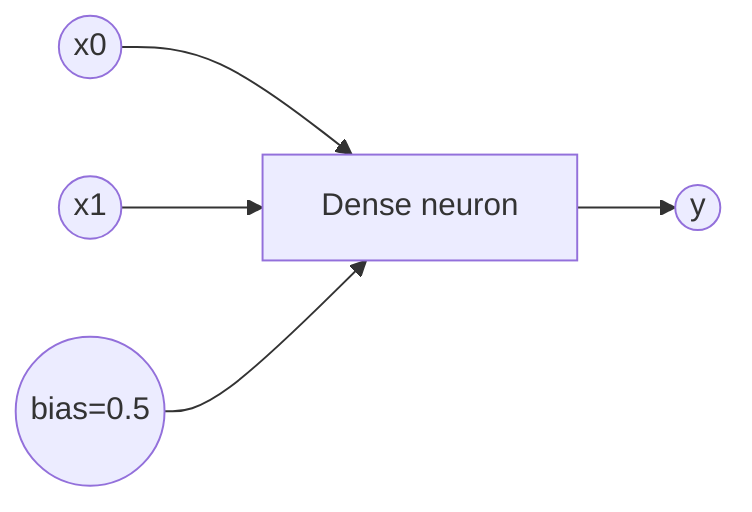
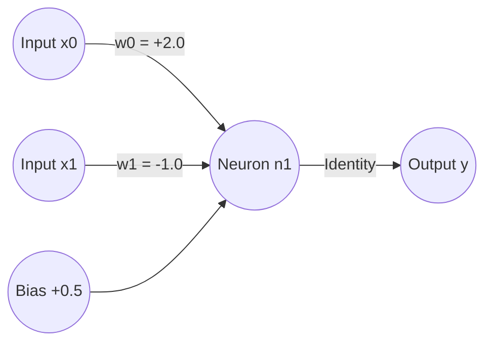
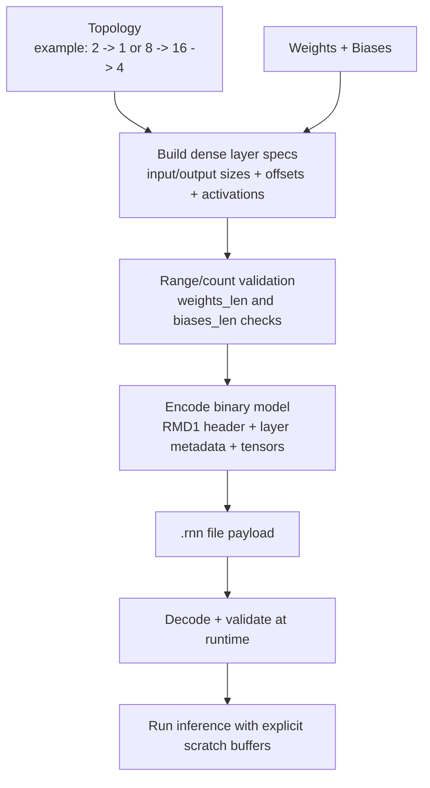
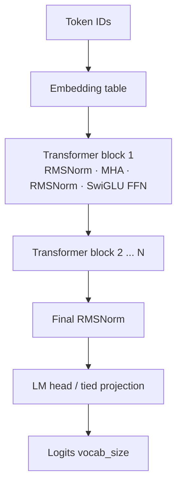

# rnn


**Clippy status**: This crate is, as of today, 100% clippy-safe — no active `clippy` warnings.

Quick links: [Overview](#what-this-project-does) · [Architecture](#complete-module-reference) · [Format](#binary-dense-format-rmd1-details) · [FFI](#ffi-integration-lifecycle) · [Compatibility](#compatibility-matrix) · [Production](#production-checklist) · [Quickstart](QUICKSTART.md)

`rnn` is a low-level Rust neural-network core built around explicit memory control, binary model formats, and FFI interoperability.

It is designed for native/embedded-style workflows where you want to control:
- how model bytes are created,
- how buffers are allocated,
- how inference is executed,
- and how the same core is reused across Rust and non-Rust runtimes.

## Table of Contents

- [What this project does](#what-this-project-does)
- [Why the generated neural network exists](#why-the-generated-neural-network-exists)
- [Schema of the generated neural network](#schema-of-the-generated-neural-network)
- [Real drawing of the generated network (actual sample values)](#real-drawing-of-the-generated-network-actual-sample-values)
- [Conceptual schema of networks built by the library](#conceptual-schema-of-networks-built-by-the-library)
- [Conceptual schema of model construction](#conceptual-schema-of-model-construction)
- [How this network is created (exact pipeline)](#how-this-network-is-created-exact-pipeline)
- [Binary dense format (`RMD1`) details](#binary-dense-format-rmd1-details)
- [RMD1 binary layout (concise spec)](#rmd1-binary-layout-concise-spec)
- [Runtime parser path (`RNN\0`) and format split](#runtime-parser-path-rnn0-and-format-split)
- [Core inference execution model](#core-inference-execution-model)
- [Language model (LM)](#language-model-lm)
- [Complete module reference](#complete-module-reference)
- [Public API groups (selected)](#public-api-groups-selected)
- [Compatibility matrix](#compatibility-matrix)
- [Build and artifacts](#build-and-artifacts)
- [Operational commands](#operational-commands)
- [Generate and validate a sample `.rnn`](#generate-and-validate-a-sample-rnn)
- [FFI integration lifecycle](#ffi-integration-lifecycle)
- [Performance notes](#performance-notes)
- [Security and safety notes](#security-and-safety-notes)
- [Versioning and stability policy](#versioning-and-stability-policy)
- [Project validation commands](#project-validation-commands)
- [Testing status](#testing-status)
- [FAQ](#faq)
- [Production checklist](#production-checklist)
- [Contributing](#contributing)
- [License](#license)

## What this project does

This project provides end-to-end building blocks to:

1. Define dense network topology and layer specs
2. Validate parameter counts and index ranges
3. Serialize models into compact binary payloads
4. Deserialize/validate payloads safely
5. Run deterministic inference with caller-provided scratch buffers
6. Expose the same runtime through a C ABI

In addition to dense flow, the crate includes a complete transformer-based language model (`lm`), a BPE tokenizer, and modules for attention, KV cache, RoPE, MoE routing, quantization, sampling, beam search, convolutions, normalization, and profiling/runtime estimation.

## Why the generated neural network exists

The sample generator in [examples/generate_sample_model.rs](examples/generate_sample_model.rs) exists to provide a deterministic, minimal artifact used for:
- format validation,
- API smoke checks,
- FFI integration checks,
- cross-language consistency checks.

It generates a tiny dense model with:
- topology: `[2, 1]`
- weights: `[2.0, -1.0]`
- bias: `[0.5]`
- activation: `Identity`

So the output is:

$$
y = 2.0 \cdot x_0 - 1.0 \cdot x_1 + 0.5
$$

This tiny model is intentionally simple so behavior is easy to verify in every language binding.

## Schema of the generated neural network



Parameter mapping for this sample:
- `w0 = 2.0` applied to `x0`
- `w1 = -1.0` applied to `x1`
- `b = 0.5`
- activation = `Identity`

## Real drawing of the generated network (actual sample values)

This is the exact neuron-level network generated by [examples/generate_sample_model.rs](examples/generate_sample_model.rs):



Operationally, the neuron computes:

$$
z = (2.0 \cdot x_0) + (-1.0 \cdot x_1) + 0.5
$$

Because the output activation is `Identity`, the final output is:

$$
y = z
$$

So for this generated sample model:

$$
y = 2.0 \cdot x_0 - x_1 + 0.5
$$

## Conceptual schema of networks built by the library

Beyond the tiny sample model, the core dense path implemented by this crate is conceptually a feed-forward stack of dense layers:

```mermaid
flowchart LR
   I[Input vector x] --> L1[Dense Layer 1<br/>W1 x + b1<br/>Activation a1]
   L1 --> L2[Dense Layer 2<br/>W2 h1 + b2<br/>Activation a2]
   L2 --> L3[... Optional hidden layers ...]
   L3 --> O[Output layer<br/>Wn h(n-1) + bn<br/>Output activation]
```

Each dense layer is represented internally with:
- `input_size`
- `output_size`
- `weight_offset`
- `bias_offset`
- `activation`

Those descriptors are chained and validated before execution (`LayerPlan::validate`).

## Conceptual schema of model construction

The dense model creation flow is explicit and deterministic:



Why this design:
- predictable memory behavior (no hidden runtime allocations in core path),
- strict structural checks before compute,
- straightforward interop with FFI consumers.

## How this network is created (exact pipeline)

### Step 1: Topology and parameters
- `topology = [2, 1]`
- user-provided `weights`, `biases`

### Step 2: Build layer specs
`build_dense_specs_from_layers` computes for each layer:
- `input_size`, `output_size`
- `weight_offset`, `bias_offset`
- activation choice (hidden vs output)

It also validates consistency with total weights/biases.

### Step 3: Encode binary payload
`encode_model_f32` (or `encode_model_f64`) writes:
- magic/version/header
- layer metadata
- packed weights
- packed biases

### Step 4: Persist bytes
The example writes the result as a `.rnn` file.

Important: in this repository, a `.rnn` file is typically a `RNN\0` container that can embed a dense `RMD1` payload.

### Step 5: Runtime consumption
At inference time:
- `parse_header` validates and inspects the `RNN\0` header
- `read_rnn` parses runtime container metadata
- `forward_dense_plan` executes with caller scratch buffers

## Binary dense format (`RMD1`) details

Dense format helpers are in [src/model_format](src/model_format) and [src/rnn_api](src/rnn_api).

**Model format — public API (summary)**

- `encoded_size_f32(layer_count, weights_len, biases_len) -> Option<usize>` : computes the expected encoded size (f32).
- `encoded_size_f64(layer_count, weights_len, biases_len) -> Option<usize>` : computes the expected encoded size (f64).
- `encode_model_f32(layers, weights, biases, out) -> Result<usize, ModelFormatError>` : encodes a dense f32 model into the provided buffer.
- `encode_model_f64(layers, weights, biases, out) -> Result<usize, ModelFormatError>` : encodes a dense f64 model into the provided buffer.
- `parse_header(bytes) -> Option<Header>` : lightweight parser to extract version, dtype and lengths without full decode.

Quick example (Rust):

```rust
let needed = encoded_size_f32(layer_count, weights_len, biases_len).unwrap();
let mut buf = vec![0u8; needed];
encode_model_f32(&layers, &weights, &biases, &mut buf).expect("encode");
```

Key characteristics:
- Magic: `RMD1`
- Versioned header
- Layer metadata contains input/output sizes, offsets, activation id
- All critical ranges are validated before use
- Decode fails on truncation, bad version/magic, invalid offsets, or capacity mismatch

This gives a strict producer/consumer contract for dense models.

## RMD1 binary layout (concise spec)

Dense `RMD1` payload layout used by `model_format`:

- Header (20 bytes total):
   - `magic` (4 bytes): `RMD1`
   - `version` (u16)
   - `flags` (u16, currently reserved)
   - `layer_count` (u32)
   - `weights_len` (u32)
   - `biases_len` (u32)
- Layer metadata array (`layer_count` entries, 20 bytes each):
   - `input_size` (u32)
   - `output_size` (u32)
   - `weight_offset` (u32)
   - `bias_offset` (u32)
   - `activation` (u8)
   - `reserved` (3 bytes)
- Weights payload (`weights_len * 4` bytes, f32 little-endian)
- Biases payload (`biases_len * 4` bytes, f32 little-endian)

Validation guarantees include:
- non-zero dimensions,
- checked offset arithmetic,
- bounds checks against tensor payload lengths,
- truncation/version/magic checks at decode.

## Runtime parser path (`RNN\0`) and format split

The repository also contains parser utilities in [src/rnn_format](src/rnn_format) with `RNN\0` magic.

So there are two format domains in the project:
- Outer container format: `RNN\0` (runtime blob + metadata/TLV)
- Inner dense payload format: `RMD1` (layer metadata + tensors)

In short: `.rnn` is `RNN\0` at file level, and it may contain `RMD1` as one embedded payload.

This is intentional in code, but requires clear pipeline discipline in production.

## Core inference execution model

Dense execution path is explicit and buffer-oriented:
- Validate plan and shape chain
- Compute scratch requirement from max width and batch size
- Use two alternating scratch lanes for layer-by-layer forward pass
- Copy final lane into output buffer

This avoids hidden execution state and keeps runtime behavior predictable.

## Complete module reference

### Core execution
- `network`: network-level checks and stats
- `layers`: layer descriptors, chaining/range validation, topology→spec conversion
- `engine`: dense forward kernels, scratch sizing, shape checks
- `inference`: batch forward wrappers, stable softmax and logits helpers
- `runtime`: memory/flops/throughput/budget estimators
- `model_config`: predefined config helpers

### Tensor and numerics
- `tensor`: tensor views, indexing, layout checks
- `scratch`: temporary memory helpers
- `activations`: activation kinds and vector application
- `normalization`: layer norm / RMS norm
- `quantization`: i8/f32 quant/dequant and mixed matmul
- `math` (in [src/lib.rs](src/lib.rs)): no-std-friendly approximations

### Training-adjacent
- `losses`: loss and reduction logic
- `metrics`: MSE/MAE/accuracy/argmax and running means
- `gradients`: norm, clipping, finite checks
- `optimizers`: optimizer update paths
- `schedulers`: LR scheduling
- `trainer`: SGD-oriented step helpers
- `initializers`: parameter count/init helpers

### Transformer-style blocks
- `attention`: scaled dot-product attention + masks/shapes
- `kv_cache`: KV cache views/errors
- `rope`: rotary position embedding application
- `sampling`: temperature/top-k/top-p sampling primitives
- `beam_search`: beam selection utilities
- `moe`: top-1 gating and routing
- `embeddings`: embedding gather and tied projection
- `lora`: LoRA delta application

### Spatial/specialized operators
- `conv3d`: 3D convolution and compatibility checks
- `conv5d`: 5D convolution forward/backward
- `sphere5d`: 5D sphere structures/helpers
- `batching`: padding and mask generation

### Language model
- `lm`: full transformer LM — config, weights, forward, training, LoRA, quantization, chat, serialization, container
- `tokenizer`: BPE trainer and encoder/decoder (vocab blob + merges)

### Formats and interop
- `model_format`: dense model encoding/decoding (`RMD1`)
- `rnn_api`: high-level dense lifecycle APIs
- `rnn_format`: runtime blob parser (`RNN\0`)
- `ffi_api`: C ABI implementation
- `public_api`: re-exported public surface
- `crypto`: hashing/integrity helpers
- `profiler`: operation counting helpers

### Additional formats and parsers
- `BMK\0` benchmark format: the crate includes a proprietary benchmark record format written as `.bmk` files (magic `BMK\0`). This format stores cryptographic-protected benchmark blobs produced by the `benchmark` module and validated by the `crypto` helpers.
 - `BMK\0` benchmark format: the crate includes a proprietary, cryptographically-protected benchmark record format written as `.bmk` files (magic `BMK\0`). These `.bmk` blobs are considered internal and are not directly decryptable in open contexts — they are produced and validated by the `benchmark` and `crypto` modules for integrity and provenance.
    - Note: non-sensitive benchmark metadata can be exported/consumed via the CSV helper/parser (a plaintext, non-sensitive CSV export). The CSV parser in `src/parser` can ingest those CSV exports to recover metadata for host-side tooling; the `.bmk` payloads themselves remain cryptographically protected and are intended for internal use only.
- Parsers: the repository exposes lightweight parsers for common host-side metadata formats (YAML, JSON, CSV) under `src/parser` to simplify ingesting dataset manifests, evaluation metadata, and wrapper-side configuration.

### Legacy note
- `embedings` exists as a legacy spelling path in repository history/structure.

## Language model (LM)

The `lm` module provides a complete causal transformer, ready for training and inference.

### Architecture



### Configuration (`LmConfig`)

| Field | Description |
|---|---|
| `vocab_size` | Vocabulary size |
| `context_len` | Maximum context length |
| `hidden_size` | Hidden dimension (`h`) |
| `ffw_size` | Internal FFN dimension |
| `num_layers` | Number of transformer blocks |
| `num_heads` | Attention heads (queries) |
| `num_kv_heads` | KV heads (GQA when `< num_heads`) |
| `rope_theta` | RoPE base |

Available presets: `LmConfig::tiny()`, `LmConfig::small()`.

### Quantization (`LmQuant`)

- `None` — native f32 / f16 weights
- `Int8` — per-channel i8 quantization (`lm_weights_quantize_int8_into`)
- `Ternary` — ternary quantization (`lm_weights_quantize_ternary_into`)

### Training

- `train_step` / `train_step_masked` : single SGD/AdamW step with cross-entropy
- `accumulate_grads` / `accumulate_grads_masked` : gradient accumulation
- `apply_grads_adamw` : AdamW update with clipping and LR scheduling
- `run_lm_train` : full training driver
- `LmTrainConfig` : hyperparameters (lr, schedule, grad_clip, weight_decay, betas)

### LoRA

- `transformer_block_forward_lora` : forward pass with LoRA deltas applied on the fly
- `AdaptedWeightBuf` / `LoraForward` : adaptation structures

### Chat

- `ChatRole` : `System`, `User`, `Assistant`, `Tool`
- `ChatMessage` / `ChatSpecialTokens` : multi-turn prompt construction
- `build_chat_prompt` : encodes a message history into a token ID sequence
- `chat_stop_ids` : stop token list for generation

### Serialization and container

- `lm_weights_write` / `lm_weights_read_into` : flat f32 serialization
- `lm_container_write` / `lm_container_read` / `lm_container_size` : LM container format
- `lm_config_encode` / `lm_config_decode` : configuration blob
- `lm_build` / `lm_build_init` : model construction and initialization

### Tokenizer (BPE)

- `train_bpe` : trains a BPE tokenizer on a raw corpus
- `write_vocab_blob` / `write_merges_blob` : artifact serialization
- `TrainerConfig` / `TrainerScratch` : training configuration and scratch
- Encoder/decoder: token ID encoding and decoding

## Public API groups (selected)

The crate's public API is documented in [public_api.md](public_api.md).

The five main entry points are:

| Function | Description |
|---|---|
| `build_f32` | Build and encode a dense f32 model |
| `build_f64` | Build and encode a dense f64 model |
| `read_rnn` | Parse and validate a `.rnn` container |
| `run` | Run inference on a loaded model |
| `train` | Perform a training step |

FFI C API: benchmark encode/decode ABI in [include/rnn_api.h](include/rnn_api.h)

## Compatibility matrix

This project is designed to be compatible across all major desktop/server OSes:

| Platform | Rust crate build | FFI artifacts | Notes |
|---|---|---|---|
| Linux | Supported | Header-based ABI in core crate | Shared/static lib packaging should be done in a `std` adapter crate |
| macOS | Supported | Header-based ABI in core crate | Same recommendation as Linux |
| Windows | Supported | Header-based ABI in core crate | Same recommendation as Linux |

General requirements:
- Rust stable toolchain
- C/C++ toolchain when consuming FFI outputs
- Platform-specific linker/runtime setup for shared libraries

## Build and artifacts

Build:

```bash
cargo build
cargo build --release
```

With current crate config, this core `no_std` crate emits Rust library artifacts.

For native shared/static artifacts (`.so`/`.dylib`/`.dll`, `.a`/`.lib`), use a dedicated `std` adapter crate that depends on this core and re-exports the C ABI (native_neural_network_std).

Wrapper usage policy: all wrappers must be used from `native_neural_network_std`.

## Operational commands

Training binaries:

```bash
cargo run --bin train_small_model
cargo run --bin train_medium_model
cargo run --bin train_large_model
cargo run --bin train_enormous_model
```

Sample generators:

```bash
cargo run --example generate_sample_model
cargo run --example generate_custom_model
cargo run --example generate_custom_model_big
cargo run --example generate_custom_model_bad
```

Scan all `.rnn` files in workspace:

```bash
rustc scan/scan_all_rnn.rs -o /tmp/scan_all_rnn && /tmp/scan_all_rnn
```

## Generate and validate a sample `.rnn`

Generate:

```bash
cargo run --example generate_sample_model -- /tmp/sample.rnn
```

Sanity-check:

```bash
ls -lh /tmp/sample.rnn
xxd -l 4 /tmp/sample.rnn
```

Expected dense header bytes correspond to `RMD1`.

## FFI integration lifecycle

C header: [include/rnn_api.h](include/rnn_api.h)

Important: wrapper integrations (Python/C++/Java/JavaScript) must target `native_neural_network_std`, not this `no_std` core crate directly.

Recommended host flow:
1. `rnn_ffi_api_version`
2. `rnn_ffi_benchmark_encoded_size`
3. `rnn_ffi_encode_benchmark_blob`
4. `rnn_ffi_decode_benchmark_blob`
5. `rnn_ffi_error_message`

## Performance notes

- Dense forward cost is dominated by matrix-vector products per layer.
- For dense stacks, per-sample compute is approximately proportional to:

$$
\sum_{l=1}^{L} (\text{in}_l \times \text{out}_l)
$$

- Batch mode reuses the same plan and alternates scratch lanes for better locality.
- Scratch requirements scale with `batch_size * max_layer_width * 2` in the current engine path.
- Quantization and runtime estimation modules can be used to pre-plan deployment budgets.

## Security and safety notes

- Never trust external model bytes by default.
- Always validate incoming payloads before inference (`required_*` and decode checks).
- Keep ABI checks/version checks enabled in cross-language hosts (`rnn_ffi_api_version`).
- Treat model files as untrusted input in service contexts (sandbox, size limits, resource guards).
- Keep wrapper and header ABI aligned (`include/rnn_api.h`, `src/ffi_api/ffi_api.rs`) when publishing FFI artifacts.

**Security hardening (recent changes)**

- `ConstantTimeEq` / `constant_time_eq` : trait and utility added in `src/crypto/hash_utils.rs` and exported via [public_api.md](public_api.md). Sensitive comparisons (magic headers, fingerprint checks) now use constant-time comparison (`constant_time_eq`) to reduce timing leaks.
- Zeroization: crypto contexts (`Sha256Ctx`, `Sha512Ctx`) and certain FFI-exposed buffers (`RnnFfiDenseModel` weights/biases) are overwritten via volatile writes in `Drop` to reduce secret lifetime in memory.
- Recommendation: audit other buffers holding sensitive data and apply explicit `zeroize` before exposure or use a secure `Drop`.

These changes are internal to the crate (no_std) — all wrapper usage must go through `native_neural_network_std`.

## Versioning and stability policy

## Visualization usage

This crate exposes allocation-free mesh helpers (slice-based) for wrapper authors and visualization tooling.

- Vertex layout: 8 floats per vertex in this order: x, y, z, nx, ny, nz, u, v.
- Index buffer type: `u32` (tri/quad indices).

API notes (examples show the common functions available in the visualization module):

- `mesh_required_buffers_from_bytes(bytes: &[u8], quad_neurons: bool, threshold: f32) -> Result<(usize, usize), Error>`
   - returns `(vertex_count, index_count)` required for the mesh.
- `fill_mesh_from_bytes(bytes: &[u8], quad_neurons: bool, threshold: f32, quad_size: f32, vertex_buf: &mut [f32], index_buf: &mut [u32]) -> Result<(usize, usize), Error>`
   - fills `vertex_buf` and `index_buf` with vertex floats and indices; returns counts actually written.

Example: using `IA_for_NNN` (high-level integration crate)

```rust
use IA_for_NNN::model_bytes;
use IA_for_NNN::visualization::{mesh_required_buffers_from_bytes, fill_mesh_from_bytes};

let bytes = model_bytes();
let (vcount, icount) = mesh_required_buffers_from_bytes(&bytes, true, 0.01).unwrap();
let mut vertices = vec![0f32; vcount * 8];
let mut indices = vec![0u32; icount];
let (written_v, written_i) = fill_mesh_from_bytes(&bytes, true, 0.01, 0.5, &mut vertices, &mut indices).unwrap();
```

Example: using `Native_Neural_Network_std` (the std wrapper)

```rust
use Native_Neural_Network_std::DenseModel;
use Native_Neural_Network_std::visualization::{mesh_required_buffers_from_rnn, fill_mesh_from_rnn};

let model = DenseModel::from_file("/tmp/sample.rnn");
let handle = model.handle();
let (vcount, icount) = mesh_required_buffers_from_rnn(handle, "model_blob").unwrap();
let mut vertices = vec![0f32; vcount * 8];
let mut indices = vec![0u32; icount];
let (written_v, written_i) = fill_mesh_from_rnn(handle, "model_blob", &mut vertices, &mut indices).unwrap();
```

Notes:
- Allocate `vertex_buf` as `vertex_count * 8` `f32` entries.
- Allocate `index_buf` as `index_count` `u32` entries.
- The functions are no-heap and expect caller-provided slices; they will not reallocate.


- Rust crate API should follow semantic versioning for public surface changes.
- C ABI changes should be treated as compatibility-sensitive and version-gated.
- Model format changes (`RMD1`) should be versioned explicitly and decoded defensively.
- Breaking changes should be documented in release notes and migration guidance.

## Project validation commands

- `cargo fmt --all`
- `cargo clippy --all-targets -- -D warnings`
- `cargo build --release`

## Subtleties and design constraints

These are important, non-obvious project subtleties:

1. **`no_std` core behavior**
   The crate is intentionally low-level and optimized for explicit runtime control.

2. **Dual format domain (`RMD1` and `RNN\0`)**
   Dense serialization and runtime blob parsing are separate concerns and must be selected deliberately per pipeline.

3. **Explicit scratch management**
   Inference APIs rely on caller-allocated buffers. This is by design for deterministic memory behavior.

4. **Strict range validation**
   Layer offsets, dimensions, and capacities are validated before execution to prevent unsafe indexing paths.

5. **FFI ABI contract stability matters**
   Any C ABI change must stay synchronized between [src/ffi_api](src/ffi_api) and [include/rnn_api.h](include/rnn_api.h).

6. **Repository currently includes broad domain modules**
   The crate is not a tiny single-purpose dense runner; it is a wide NN systems toolbox.

## Testing status

As requested for this repository:
- no in-repo unit-test focus is currently documented here,
- a dedicated `std` wrapper crate is planned,
- all unit tests are intended to be centralized in that wrapper (`Native_Neural_Network_std`).

## FAQ

### Why `no_std`?
To keep the core deterministic and portable for constrained/native runtimes.

### Why both `RMD1` and `RNN\0` paths?
They represent two format domains in the repository (dense serialization vs runtime parser utilities). Keep pipeline usage explicit.

### Why a separate `std` wrapper for unit tests?
To keep this core focused on runtime/format/FFI behavior while enabling richer testing ergonomics in a host-friendly crate.

### Can I use this on Windows/Linux/macOS?
Yes. The crate and FFI flow are designed for all three platforms with standard Rust + native toolchains.

## Production checklist

- [ ] Build release artifacts (`cargo build --release`)
- [ ] Validate exported ABI from `include/rnn_api.h` against wrappers
- [ ] Generate and verify sample model (`examples/generate_sample_model.rs`)
- [ ] Verify FFI lifecycle in your host runtime (encode/decode/error handling)
- [ ] Apply resource limits and input validation for model loading
- [ ] Track runtime budgets (memory/FLOPs/throughput) before deployment

## Contributing

Contributions are welcome.

Suggested local checks:

```bash
cargo fmt --all
cargo clippy --all-targets -- -D warnings
cargo build --release
```

For major changes, open an issue first with:
- scope,
- impacted modules,
- compatibility expectations.

## License

MIT.

See [LICENSE](./LICENSE).
